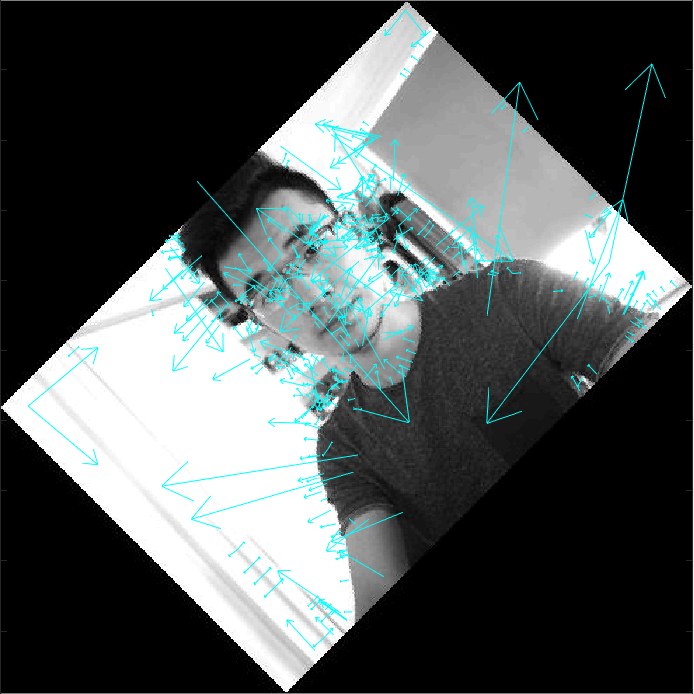

# SIFT-MATLAB
Extract and match features using SIFT descriptors

## Code Structure

	main.m       - the entry point of the program
	sift.m       - script that involkes SIFT program based on various OS
	SIFTmatch.m  - match SIFT descriptors according to the distance in Euclidean space
	showkeys.m   - display SIFT descriptors
	
## Sample Experiment Results
__Extracted SIFT descriptors__   

  

__Matched SIFT features__

  

## Usage
Clone the repository using the following command

<pre><code>git clone https://github.com/DzReal/SIFT-MATLAB.git</pre></code>

*Note:* This program doesn't work on MacOS. Please choose Windows, Linux or other Unix-like OS
